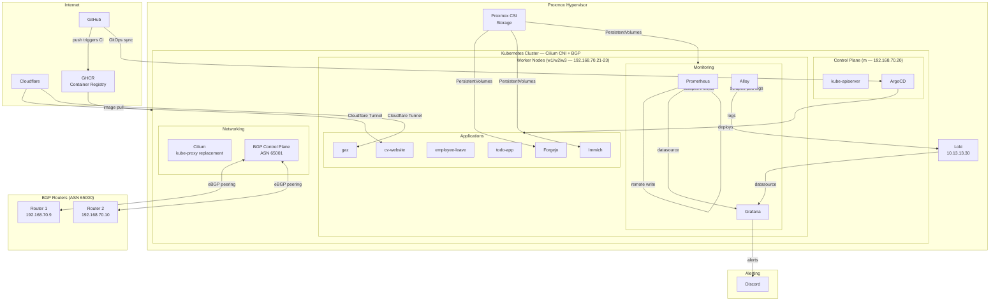

# Infrastructure Overview

Personal homelab running a self-hosted Kubernetes cluster on Proxmox, managed with GitOps and monitored with a full observability stack.

## Architecture

## Stack

| Layer | Technology |
|-------|-----------|
| Hypervisor | Proxmox VE |
| OS | Ubuntu 22.04 (provisioned with Ansible) |
| Kubernetes | kubeadm, v1.31 |
| CNI | Cilium (kube-proxy replacement, BGP control plane) |
| GitOps | ArgoCD |
| CI/CD | GitHub Actions → GHCR |
| Ingress | Cloudflare Tunnel |
| Storage | Proxmox CSI Plugin |
| Monitoring | Prometheus + Grafana + Alloy + Loki |
| Alerting | Grafana → Discord webhooks |
| Git hosting | Forgejo (self-hosted) + GitHub |

## Repositories

| Repository | Description |
|------------|-------------|
| [cv-website](https://github.com/pascariucosmin93/cv-website) | Personal CV — static site with Docker + GitHub Actions CI/CD |
| [cv-gitops](https://github.com/pascariucosmin93/cv-gitops) | GitOps manifests for cv-website (ArgoCD + Kustomize) |
| [k8s-sh](https://github.com/pascariucosmin93/k8s-sh) | Shell scripts for bootstrapping the Kubernetes cluster |
| [vm-bootstrap-ansible](https://github.com/pascariucosmin93/vm-bootstrap-ansible) | Ansible roles for VM provisioning and security hardening |
| [k8s-network-policies](https://github.com/pascariucosmin93/k8s-network-policies) | Kubernetes + CiliumNetworkPolicy for all namespaces |
| [monitoring-stack](https://github.com/pascariucosmin93/monitoring-stack) | Helm values and ArgoCD apps for the observability stack |
| [calculatorgaz](https://github.com/pascariucosmin93/calculatorgaz) | Gas price simulator — TypeScript microservices app |

## Network

- **BGP ASN**: 65001 (cluster) peering with 65000 (routers)
- **LoadBalancer pools**: `10.30.10.0/24` (apps), `10.40.10.0/24` (internal tools)
- **External access**: Cloudflare Tunnel (no open ports on the router)
- **Network policies**: default-deny per namespace with explicit allow rules
